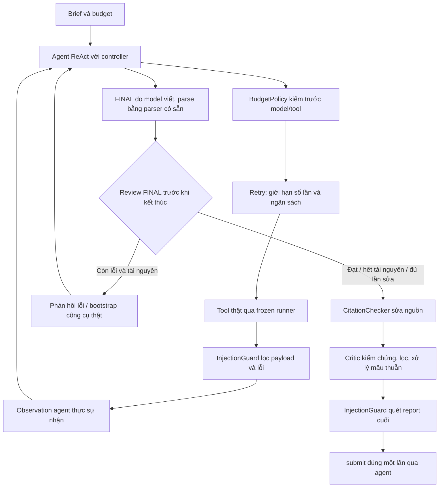

# Thiết kế harness — Agent Arena

## Mục tiêu và phạm vi

Harness dùng agent ReAct có vòng kiểm tra và sửa FINAL, cùng 5 layer. Giữ nguyên runner, parser, `MAX_STEPS = 40` và nguồn gốc claim. Thiết kế ưu tiên ba bất biến: **chỉ sử dụng bằng chứng agent đã thấy; không viết lại lời trích của model; luôn chừa ngân sách để nộp report**.

Code triển khai không đọc `required_facts`, đáp án verdict, cờ bẫy, `Doc.tags` hoặc danh sách ID của đề public. Brief đi vào runner chỉ cần `question_vi`, `budget` và ID để ghi log. `evaluate.py` là công cụ phát triển riêng, không được layer import hay sử dụng lúc trả lời.

## Luồng xử lý



Stack: `[InjectionGuard, Critic, CitationChecker, BudgetPolicy, Retry]`. Wrapper đầu đứng ngoài cùng; `after_agent` chạy ngược. Việc nộp report vốn được agent thực hiện ngoài wrapper, tránh retry một thao tác có tác dụng phụ.

## Các quyết định hệ thống

### 0. Kiểm tra trước khi kết thúc

`agent.py` tự bật `RunController` khi stack có reviewer, trong full stack là Critic. Không cần giảng viên thêm cờ CLI để bật. `adaptive=False` cho phép so sánh cùng 5 layer với vòng lặp thụ động; stack trống/logging giữ baseline cũ.

`middleware.py` thêm hook tùy chọn `review_final`, giữ nguyên thứ tự 6 hook bắt buộc. Reviewer nhận bản sao report và trả `FinalIssue`, không sửa report hoặc viết claim mới. `after_agent` vẫn chỉ chạy một lần. Critic phát hiện schema sai, claim không nguyên văn, nguồn hết hiệu lực, mâu thuẫn số liệu và thiếu/sai dạng verdict khi câu hỏi có phương án.

Controller cho tối đa 2 lần sửa FINAL. Nếu model kết luận trước truy xuất, controller có thể bootstrap search bằng câu hỏi và fetch ID thực sự nhận được từ search; các call đi qua nguyên stack và frozen Tools. Nếu không có claim hỗ trợ sau một truy vấn, feedback yêu cầu đổi sang thuật ngữ tìm được trong tài liệu. Model vẫn phải tự viết lại FINAL.

Cache chỉ giữ search/fetch thành công, không có marker suy giảm, và đã qua guard. Cache hit tái sử dụng observation thật cũ, ghi `layer` event; không ghi tool call giả. Sau 3 lượt không có bằng chứng mới, controller yêu cầu FINAL; nếu vẫn không theo giao thức thì dừng có chẩn đoán sau 2 lượt nữa. Không có FINAL thật thì báo thiếu provenance.

Khi còn FINAL trước đó nhưng không đủ token/deadline để sửa, dùng bản model đã viết làm fallback rồi lọc an toàn. Dự toán một lần sửa gồm prompt kế tiếp và 512 token output; đây là kiểm tra mềm, không bảo đảm một endpoint đang chạy sẽ hoàn tất trong thời gian còn lại.

Lượt đầu dùng hướng dẫn chọn truy vấn theo nghiệp vụ; prompt do caller tự cung cấp vẫn được giữ nguyên. Khi đã đọc FAQ/báo cáo/ghi chú liên quan nhưng câu hỏi yêu cầu quy định, controller có thể tìm lại theo `Chủ đề:` đã quan sát và đọc văn bản chính thức từ kết quả thật. Giới hạn hai call bổ sung, k tối đa 10 và luôn dự trữ submit. Không tra topic hoặc ID từ dữ liệu chưa truy xuất.

Review phát hiện quote bỏ điều kiện trong cùng dòng đã đọc và chỉ ra vị trí dòng để model chép lại, không tự vá claim bằng corpus. Nếu câu hỏi chỉ rõ đơn vị giữ thống kê, review cũng phát hiện con số của đơn vị khác. BudgetPolicy hiệu chỉnh dự toán prompt bằng usage thực tế của endpoint để chừa lượt FINAL; vẫn giữ toàn bộ observation.

Thiết kế tham khảo truy xuất/tự phản hồi trong [Self-RAG](https://arxiv.org/abs/2310.11511), điều chỉnh mức truy xuất trong [Adaptive-RAG](https://aclanthology.org/2024.naacl-long.389/), và đánh giá kết quả truy xuất để chọn hành động sửa trong [CRAG](https://arxiv.org/abs/2401.15884). Đây là việc áp dụng nguyên tắc vào giao thức lab; không triển khai các mô hình được huấn luyện trong những bài báo này.

### 1. Bằng chứng có nguồn và có phạm vi quan sát

`layers/_evidence.py` chứa logic dùng chung. `remember_result` ghi scope của fetch thành công và snippet search. Khi lập `EvidenceIndex`, scope chỉ được tin nếu **thực sự có trong observation cuối sau các outer layer**. Một raw payload chứa injection được inner layer thấy nhưng đã bị guard gỡ sẽ không trở thành bằng chứng.

Một câu cần khớp cả một dòng của tài liệu gốc và scope đã quan sát. Vì vậy:

- Fetch bị cắt chỉ hỗ trợ phần đã đến agent, không hỗ trợ đoạn chưa đọc.
- Search snippet JSON được giải mã để đối chiếu nguyên văn; title và metadata của search không được coi là nội dung tài liệu.
- Không nối hai observation để giả vờ đã đọc đủ một tài liệu.
- Tài liệu chưa fetch không được mạo danh nguồn đã fetch dù có body giống hệt.
- Khi nhiều nguồn đã quan sát cùng hỗ trợ một câu, giữ nguồn hiện tại nếu hợp lệ; nếu cần sửa, chọn ổn định theo doc ID.

Khi gọi hook trực tiếp mà không qua các wrapper ghi scope, index có fallback dùng tài liệu nguyên vẹn trong một observation, phù hợp contract scaffold. Muốn chứng minh chính xác nguồn trong tình huống body trùng nhau cần chạy qua stack đầy đủ.

### 2. Claim được kiểm chứng mà không mất provenance

CitationChecker chỉ đổi nguồn. Critic loại dữ liệu sai kiểu/không có bằng chứng, tách câu ghép khi từng vế có nguồn riêng, loại trùng và áp dụng giới hạn 10 claim, 4 claim/nguồn, 500 ký tự.

Các thao tác trên text đều là giữ nguyên hoặc lấy **substring của chính text model đã viết**: có thể bỏ khoảng trắng/ngoặc bao ngoài nếu phần còn lại khớp evidence, hoặc cắt bớt quote quá dài. Không tự thêm dấu câu, không paraphrase, không vá bằng corpus. Một câu nhiều dòng không được công nhận chỉ vì nằm trong body.

Nếu model đưa quá nhiều claim, ưu tiên độ giao nhau của từ nội dung với câu hỏi; không dùng đáp án chuẩn để chọn. Nếu bỏ claim bịa, answer được dựng lại từ các quote còn giữ để không tiếp tục trình bày bịa đặt trong phần văn xuôi. Khi không còn evidence, abstain và xóa verdict tự tin.

Report cuối được chuẩn hóa các kiểu cơ bản: claims/citations là list, answer là string, abstain là boolean. Chuỗi `"false"` không bị xem là true do truthiness của Python.

### 3. Mâu thuẫn là một tín hiệu thận trọng

Critic xử lý cả câu ghép và các quote độc lập. Tín hiệu hiện tại yêu cầu nguồn khác nhau, chủ đề không khác nhau nếu có header đã đọc, và các ràng buộc số cùng đơn vị/cùng ngữ cảnh hoặc liên từ đối lập có chủ thể chung. Nguồn ghi rõ đã bị thay thế không tự tạo một mâu thuẫn chưa giải quyết.

Hai báo cáo có số lượng khác nhau hoặc hai chính sách khác chủ đề dùng cùng mẫu câu không bị đánh đồng là mâu thuẫn. Khi có tín hiệu đủ mạnh, giữ bằng chứng hai phía, abstain và không tự chọn verdict.

**Giới hạn:** đây là heuristic theo văn bản, không phải bộ suy luận ngữ nghĩa đầy đủ. Phủ định không dùng số, thay đổi phạm vi áp dụng, ngoại lệ hay hiệu lực pháp lý phức tạp vẫn cần model nhận diện và trả lời thận trọng. Không dùng cờ gold để giải quyết giới hạn đó.

### 4. Injection được xử lý ở biên và ở đầu ra

InjectionGuard lọc các block lab, hỗ trợ lặp/nested, khác hoa thường và trường hợp thiếu dấu đóng. Nó còn cách ly block giả vai trò system/developer và một số mệnh lệnh trực tiếp phổ biến. Nội dung an toàn ngoài block được giữ nguyên, đoạn bị gỡ có placeholder.

Search JSON được xử lý theo cấu trúc để không phá dấu nháy hoặc nuốt các kết quả khác khi một snippet độc bị cắt. Guard cũng lọc error vì error được agent đưa vào observation. Ở report cuối, quote bị nhiễm bị **xóa**, không sửa text; canary trong metadata, field phụ và khóa của report được quét.

**Giới hạn:** bộ lọc pattern không bảo đảm phát hiện mọi prompt injection mới, gián tiếp hoặc bị mã hóa. Nó bao phủ các dạng đã test và giữ nguyên nguyên tắc tài liệu là dữ liệu. Không xem việc xóa riêng canary là đủ để chứng minh an toàn tổng quát.

### 5. Ngân sách được kiểm ở cả outer policy và từng retry

`layers/_resources.py` chia sẻ kiểm tra số call và trạng thái dừng. Mỗi lần gọi phải còn đủ chỗ cho cả call đó và phần dự trữ submit; xử lý được budget `None`, số phân số và số không hữu hạn.

BudgetPolicy thêm NUDGE có `FINALIZE_SENTINEL` khi cần kết thúc, giữ nguyên toàn bộ bằng chứng trong messages. Nó đếm token model đã báo và dùng clock monotonic cho deadline; reserve token mặc định 512, dự trữ thời gian tối đa 1 giây. Clock có thể truyền vào để test không cần sleep.

Retry kiểm ngân sách **trước lần đầu và từng lần thử lại**, tôn trọng cả phần reserve của outer policy và deadline đã thiết lập. Chỉ retry search/fetch/calc; lỗi cố định như doc không tồn tại hoặc biểu thức sai không tiêu thêm lượt vô ích. Ngoài marker của scaffold, retry nhận biết fetch rỗng và search JSON sai cấu trúc.

Nếu các lần sau timeout nhưng một lần trước có nội dung bị cắt còn dùng được, trả chính payload thật tốt nhất đã nhận, giữ marker suy giảm; không bịa dữ liệu. Tổng lần thử mặc định 3, tính cả lần đầu.

**Giới hạn:** tool-call budget được chặn trước call. Token và thời gian là điều khiển mềm: một model/tool call đang chạy vẫn có thể vượt ngưỡng, và FINAL cuối cũng tiêu token. Frozen runner chịu trách nhiệm timeout và giới hạn cứng. Không tạo FINAL giả để né chi phí.

### 6. Trạng thái riêng cho từng lượt chạy

Các layer giữ cấu hình trên instance và trạng thái động trong `ctx.state`; không có cache hoặc counter dùng chung giữa các brief. Report được tạo bằng bản sao, tránh thay đổi dữ liệu đầu vào và không ghi lại lịch sử trace. Exception lập trình trong hook tiếp tục lộ ra khi test.

Các chỉ số chẩn đoán: `citation_checker.repaired`, `critic.kept`, `critic.removed`, `critic.conflict`, `injection_guard.filtered`, `injection_guard.dropped_claims`, `retry_attempts`, `retry.budget_stops`, `budget.reason`, `budget.blocked`, `budget.tokens`. Chúng không được đưa vào claim hoặc dùng để tạo điểm.

## Cách kiểm chứng

```powershell
python -X utf8 -m pytest -q tests/test_layers_behavior.py
python -X utf8 scripts/run_practice.py --layers none --tag baseline --out runs/baseline.json
python -X utf8 scripts/run_practice.py --out runs/full-stack.json
python -X utf8 scripts/selfeval.py --run runs/full-stack.json
python -X utf8 -m harness.evaluate --out runs/evaluation.json
python -X utf8 -m harness.probes --out runs/adaptive-probes.json
python -X utf8 -m harness.diagnostics runs/full-stack-adaptive.json runs/adaptive-probes.json
```

`evaluate.py` chạy 9 public brief × 5 seed × 7 cấu hình (baseline, full, bỏ lần lượt từng layer), tổng **315 lượt**. Công cụ báo điểm, gate, FINAL, call vượt budget, canary và lỗi. Độ lệch chuẩn được tính riêng từng brief rồi lấy trung bình để không lẫn mức khó khác nhau của các câu hỏi với độ dao động do flaky tool. Tool flaky được bật mặc định.

Tests bổ sung dùng corpus tự tạo, claim sai kiểu, quote bọc dấu nháy, snippet escape JSON, scope bị guard gỡ, source chưa đọc/trùng body, nhiều loại injection, mâu thuẫn và false positive, token/deadline/reserve, retry lỗi cố định và transient, tái sử dụng layer, biến thể FINAL của model thật. Có smoke test **3 corpus seed mới × 5 budget**, và test truy vấn lại + synthesis qua runner shield brief.

## Kết quả đã đo trên public/mock

| Cấu hình | Điểm trung bình 5 seed | Trung bình độ lệch chuẩn trong từng brief |
|---|---:|---:|
| Baseline | 25.09 | 5.13 |
| Full stack | 81.71 | 0.00 |
| Bỏ injection_guard | 74.09 | 0.73 |
| Bỏ critic | 69.77 | 0.00 |
| Bỏ citation_checker | 52.62 | 0.00 |
| Bỏ budget_policy | 81.32 | 0.63 |
| Bỏ retry | 74.31 | 11.72 |

Full stack có **0 lỗi, 0 trace gate fail, 0 thiếu FINAL, 0 canary leak, 0 lượt vượt tool budget** trong 45 lượt public. Seed mặc định của baseline đạt 24.27; full stack đạt 81.71. Độ lệch chuẩn 0 chỉ là quan sát trên 5 seed này, không phải bảo đảm cho seed khác.

Public `pub-08` và `pub-09` còn yếu với MockModel vì mock không thực hiện truy xuất sâu/quyết định synthesis như model thật. Test model giả lập hành vi requery/synthesis chứng minh pipeline giữ được evidence và verdict, **không chứng minh model thật sẽ lựa chọn đúng**. Đã chạy API OpenAI `gpt-4.1-mini`; báo cáo kết quả thực tế nằm trong `.agent/REAL_MODEL_REPORT.md`, trace trong `runs/real-public-final.json`. Chưa có bộ private của giảng viên.

`harness.probes` có 5 tình huống × 3 seed × 2 chế độ = 30 lượt qua frozen runner. Cùng bộ safety layer, controller phục hồi từ FINAL sớm/trích sai/từ chối sau một query: **29.26 → 100**; thiếu verdict: **70.07 → 100**; fetch lặp: giữ 100 điểm và giảm **5 → 3 tool call**. Model scripted có sẵn các lượt sửa để đo agent có cho sửa và giữ provenance hay không; các số này không phải điểm API thật hay ước lượng điểm private. JSON lưu cả trace từng lượt để kiểm lại.

## Kiểm chứng toàn bộ và môi trường

Môi trường Windows của checkout dùng CRLF cho file Python do `core.autocrlf=true`; một số kiểm tra MD5 mong LF, các test CLI dựng environment POSIX và một số test có ID dài gây lỗi đường dẫn tạm. Đây là vấn đề có ngay trước khi triển khai layer.

Kiểm chứng mới nhất bằng Python 3.12 + pytest 8 trên WSL Ubuntu: **898 test pass, 0 fail/error/skip; verify đạt 21/21**. Có **141 test hành vi bổ sung** pass trực tiếp trên Windows. Script `.agent/validate_wsl.py` chỉ đọc project, copy sang thư mục tạm và chuẩn hóa LF trong **bản sao** như Git blob; không sửa source frozen, checksum mong đợi hoặc tắt test. Kết quả nằm trong `.agent/linux-tests.xml` và `.agent/linux-validation.log`. Docker validator tương đương vẫn có trong `.agent/validate_linux.py`; lượt mới dùng WSL vì Docker engine đang trả lỗi 500.

Để chạy lại khi có Docker:

```powershell
docker build -f .agent/Dockerfile.validation -t agent-arena-validation:local .agent
docker run --rm --network none --mount "type=bind,source=$((Get-Location).Path),target=/source,readonly" --mount "type=bind,source=$((Get-Location).Path)\.agent,target=/results" agent-arena-validation:local /source/.agent/validate_linux.py
```

`.agent/` bị Git ignore. Code nộp vẫn là `harness/`; `harness/README.md`, `harness/evaluate.py` và `tests/test_layers_behavior.py` có thể được commit để reviewer đọc và tái lập đánh giá. Kết quả trong `runs/` không dùng làm điểm nộp.

Có thể chạy validator WSL bằng `wsl -d Ubuntu -- python3 /mnt/d/Sukem/VinUni/Track2/K4-DAY16-Track3A-LeThiThuyTrang-2A202602678-AgentArena/.agent/validate_wsl.py`. Script tạo venv trong /tmp, cài pytest nếu cần và in đường dẫn JUnit trong thư mục tạm; copy artifact về .agent bằng file tools phía Windows.
